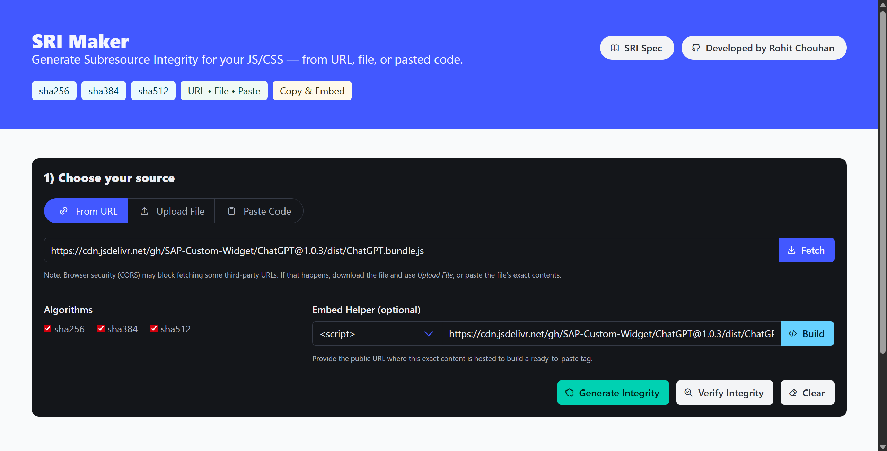
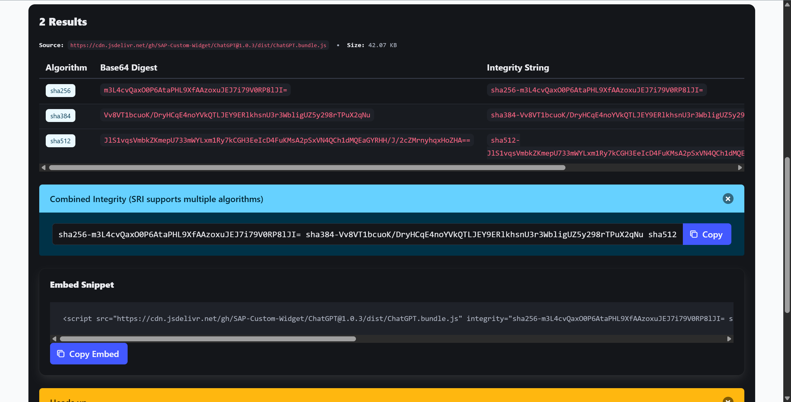
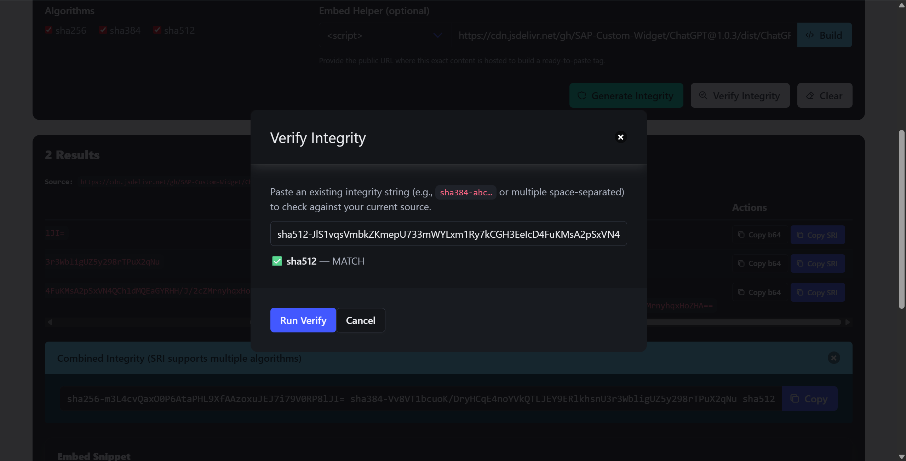

# 🔒 SRI Maker  
  
  

A modern, privacy-friendly web tool to generate **Subresource Integrity (SRI)** hashes for your JavaScript and CSS files.  
Built with **Bulma** and the **Web Crypto API**, fully client-side — no data leaves your browser.  

👉 Live site: **[sri-maker.js.org](https://sri-maker.js.org)**  

---

## ✨ Features
- 📂 **Multiple sources**: Generate from a URL, file upload (drag & drop), or pasted source code.  
- 🔐 **Hash algorithms**: Supports `sha256`, `sha384`, and `sha512`.  
- 🧩 **Embed builder**: Auto-creates ready-to-use `<script>` or `<link>` tags with `integrity` + `crossorigin`.  
- 🛡️ **Integrity verifier**: Paste existing SRI strings to check against your source.  
- 🌙 **Dark mode**: Built-in theme switcher with system preference detection.  
- 📋 **Copy helpers**: One-click copy for Base64, SRI strings, and full embed snippets.  
- ⚡ **100% offline**: Everything runs in the browser, no uploads, no tracking.  

---

## 🖼️ Screenshots

##### `Screenshot 1`

##### `Screenshot 2`

##### `Screenshot 3`

  
---

## 🚀 Usage
1. Visit [sri-maker.js.org](https://sri-maker.js.org).  
2. Select your source (URL, file, or paste code).  
3. Choose hashing algorithms (`sha256`, `sha384`, `sha512`).  
4. Click **Generate**.  
5. Copy the SRI string or ready-to-use embed code.  

### Copyright and License

> Copyright © 2025 **[Rohit Chouhan](https://rohitchouhan.com)**. Licensed under the _[MIT LICENSE](https://github.com/rohit-chouhan/sri-maker/blob/main/LICENSE)_.